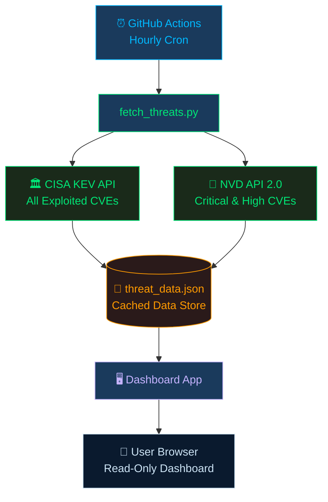

# 🛡️ Global Cyber Threat Intelligence Dashboard

### 🔗 [**View Live Dashboard →**](https://cyber-threat-intel-p2y0.onrender.com)

*Real-time tracking of actively exploited vulnerabilities and critical CVEs*

---

## 📌 What This Dashboard Does

A dark-themed cybersecurity intelligence dashboard that aggregates and visualizes threat data from two authoritative U.S. government sources — updated automatically every hour with zero manual intervention.

> **No API calls from the browser. All data is pre-fetched and cached via GitHub Actions.**

---

## 📊 Data Sources

| Source | Coverage | Frequency |
|--------|----------|-----------|
| [**CISA KEV Catalog**](https://www.cisa.gov/known-exploited-vulnerabilities-catalog) | All known actively exploited vulnerabilities | Hourly |
| [**NVD API 2.0**](https://nvd.nist.gov/developers/vulnerabilities) | Critical and High CVEs (CVSS 7.0+), last 7 days | Hourly |

---

## 🎯 Dashboard Features

| Feature | Description |
|---------|-------------|
| 📈 **Stat Cards** | Live counts — Active KEVs, Critical CVEs, High CVEs, Ransomware KEVs |
| 📊 **Vendor Bar Chart** | Top 10 vendors by KEV count with source attribution |
| 🚨 **Ransomware Panel** | Real-time ransomware-associated CVE alerts with due-date countdown |
| 🔍 **KEV Search** | Filter full catalog by CVE ID, vendor, or product |
| ⏱️ **Days in KEV** | How long each vulnerability has been actively exploited |
| 📉 **Severity Pie + Trend** | NVD CVE breakdown and daily publication trend |
| 🇮🇳 **India / APAC Focus** | Filtered view for critical infrastructure vendors in the region |
| 🕐 **Auto-Refresh Badge** | Hourly data freshness indicator |

---

## 🏗️ Architecture

**Zero browser-side API calls — no CORS issues, no rate limits.**

---

## 🛠️ Tech Stack

| Layer | Technology |
|-------|-----------|
| **UI & Visualization** | Plotly · Custom CSS |
| **Data Pipeline** | Python 3.11 · Requests · Pandas |
| **Scheduling** | GitHub Actions (hourly cron) |
| **Data Format** | JSON cache (data/threat_data.json) |

---

## 🔒 Data Integrity and Attribution

All data displayed is sourced **exclusively** from official U.S. government public databases:

- **CISA KEV** — Cybersecurity and Infrastructure Security Agency
- **NVD** — National Institute of Standards and Technology (NIST)

Vendor and product names appear exactly as recorded in these official sources.
No editorial judgment or security rating of any vendor is implied.

---

## 🌏 Regional Context — India / APAC

The dashboard includes a dedicated India/APAC panel aligned with **CERT-In** advisories:
- 6-hour incident reporting mandate for critical sectors
- Commonly targeted vendors in APAC infrastructure tracked separately
- AI-driven phishing campaign awareness context

---

** [Kasu Mallikarjuna](https://www.linkedin.com/in/mallikarjuna-k-a98a67160)**

*Data refreshes hourly · Powered by GitHub Actions*

